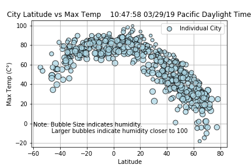

# Visualizing Weather Data with Python

Whether financial, political, or social -- data's true power lies in its ability to answer questions definitively. So let's answer a fundamental question: "What's the weather like as we approach the equator?"

But, of course: _"Duh. It gets hotter..."_

But, if pressed, how can I **prove** it?

## WeatherPy

I'll be creating a Python script to visualize the weather of 500+ cities across the world of varying distance from the equator. To accomplish this, I'll be utilizing a [simple Python library](https://pypi.python.org/pypi/citipy), the [OpenWeatherMap API](https://openweathermap.org/api), and a little common sense to create a representative model of weather across world cities.

My objective is to build a series of scatter plots to showcase the following relationships:

* Temperature (F) vs. Latitude
* Humidity (%) vs. Latitude
* Cloudiness (%) vs. Latitude
* Wind Speed (mph) vs. Latitude

My final notebook will:

* Randomly select **at least** 500 unique (non-repeat) cities based on latitude and longitude.
* Perform a weather check on each of the cities using a series of successive API calls.
* Include a print log of each city as it's being processed with the city number and city name.
* Save both a CSV of all data retrieved and png images for each scatter plot.

Once I have analyzed and visualized our data, I will build a web dashboard that allows convenient access and presentation of data and findings.

The deployed dashboard is available here: [Weather Data Dashboard](https://weatherdata-dash.herokuapp.com/)

---
Omari B 2019
